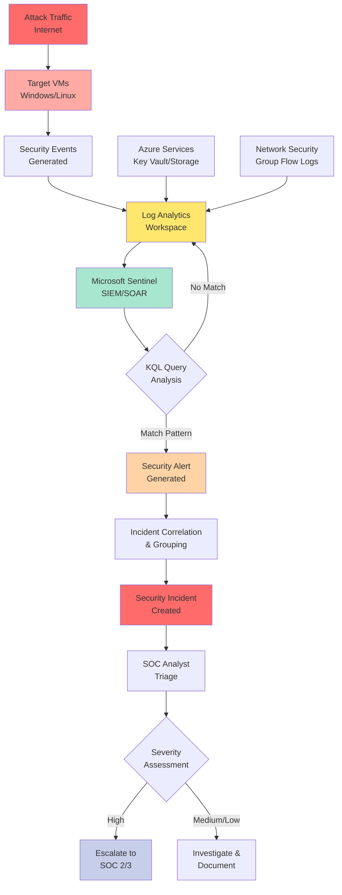
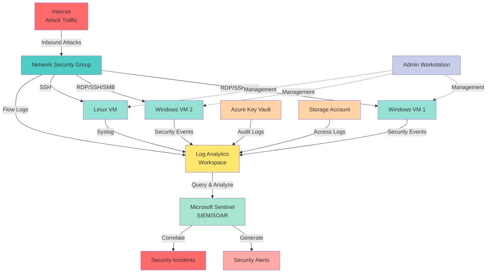

# Azure Honeynet & SOC Project


## Overview

This project demonstrates the implementation of a cloud-based honeynet security operations center (SOC) using Microsoft Azure. The project showcases practical experience with SIEM operations, threat detection, log analysis, and security control implementation in a production-like Azure environment.

**Key Learning Outcomes:**
- SIEM/SOAR platform configuration (Microsoft Sentinel)
- Security log ingestion and analysis
- Custom KQL (Kusto Query Language) query development
- Security control implementation and effectiveness measurement
- Threat detection and incident response workflows

## Project Summary

A honeynet infrastructure was deployed in Microsoft Azure with intentionally exposed resources to attract and capture real-world attack traffic. Security logs from multiple sources were ingested into a Log Analytics workspace and analyzed using Microsoft Sentinel. The project measured security metrics before and after implementing security controls, demonstrating the effectiveness of security hardening measures.

### Security Metrics Tracked

- **SecurityEvent** - Windows Event Logs (authentication, failed logins, etc.)
- **Syslog** - Linux system logs (SSH authentication failures)
- **SecurityAlert** - Automated alerts triggered by Log Analytics
- **SecurityIncident** - Incidents created by Microsoft Sentinel
- **AzureNetworkAnalytics_CL** - Network Security Group logs (malicious traffic flows)

### SOC Workflow



## Architecture

### Before Security Hardening


### After Security Hardening


### Infrastructure Components

The honeynet architecture consists of the following Azure services:

- **Virtual Network (VNet)** - Network isolation and segmentation
- **Network Security Group (NSG)** - Network-level access control
- **Virtual Machines** - 2 Windows VMs, 1 Linux VM (target hosts)
- **Log Analytics Workspace** - Centralized log collection and storage
- **Azure Key Vault** - Secrets management and access monitoring
- **Azure Storage Account** - Blob storage with access logging
- **Microsoft Sentinel** - SIEM/SOAR platform for threat detection and response

### Architecture Diagram



### Security Control Implementation

**Initial State (Before Hardening):**
- All resources exposed to the public internet
- Network Security Groups configured to allow all inbound traffic
- Virtual machine firewalls disabled
- No Private Endpoints configured (public endpoints only)
- Resources intentionally vulnerable to attract attack traffic

**Hardened State (After Security Controls):**
- Network Security Groups configured with deny-all rules except admin workstation
- Virtual machine firewalls enabled and configured
- Private Endpoints implemented for Key Vault and Storage Account
- Zero-trust network access principles applied

## Attack Visualization & Metrics

### Attack Maps (Before Security Controls)

The following visualizations show the geographical distribution of attack traffic captured during the initial 24-hour monitoring period:


*Network Security Group logs showing malicious traffic flows allowed into the honeynet*


*Geographical distribution of SSH brute force attempts against Linux hosts*


*Geographical distribution of RDP/SMB authentication failures on Windows hosts*

### Security Metrics Comparison

#### Before Security Hardening
**Monitoring Period:** March 15, 2023 17:04:29 - March 16, 2023 17:04:29 (24 hours)

| Metric                   | Count    | Description
| ------------------------ | -------- | -----------
| SecurityEvent            | 19,470   | Windows security events (authentication attempts, failed logins)
| Syslog                   | 3,028    | Linux system logs (primarily SSH authentication failures)
| SecurityAlert            | 10       | Automated alerts triggered by Log Analytics rules
| SecurityIncident         | 348      | Security incidents created by Microsoft Sentinel
| AzureNetworkAnalytics_CL | 843      | Malicious network flows allowed through NSG rules

#### After Security Hardening
**Monitoring Period:** March 18, 2023 15:37 - March 19, 2023 15:37 (24 hours)

| Metric                   | Count | Description
| ------------------------ | ----- | -----------
| SecurityEvent            | 8,778 | Windows security events (reduced by 55%)
| Syslog                   | 25    | Linux system logs (reduced by 99%)
| SecurityAlert            | 0     | No automated alerts triggered
| SecurityIncident         | 0     | No security incidents created
| AzureNetworkAnalytics_CL | 0     | No malicious flows allowed through NSG

> **Note:** Attack map queries returned no results during the post-hardening period, indicating complete mitigation of malicious inbound traffic.

## Results & Key Findings

### Security Control Effectiveness

The implementation of security controls resulted in a **100% reduction** in security incidents and alerts, demonstrating the critical importance of proper network security configuration:

1. **Zero Security Incidents** - No incidents generated after hardening (down from 348)
2. **Zero Security Alerts** - All automated alert rules remained inactive (down from 10)
3. **99% Reduction in Syslog Events** - Linux authentication failures reduced from 3,028 to 25
4. **55% Reduction in Security Events** - Windows security events reduced from 19,470 to 8,778
5. **Complete Network Protection** - Zero malicious flows allowed through NSG rules (down from 843)

### Key Takeaways

- **Network Security Groups (NSGs)** are foundational to Azure security - properly configured NSGs completely blocked malicious inbound traffic
- **Private Endpoints** eliminate public attack surface for critical services
- **Defense in Depth** - Combining NSGs, host firewalls, and Private Endpoints provides layered security
- **SIEM Visibility** - Comprehensive logging and monitoring enable accurate security posture measurement

### Project Deliverables

This repository includes:

- **KQL Query Library** - Custom queries for threat detection across Windows, Linux, Azure AD, Key Vault, and Storage Accounts
- **Sentinel Analytics Rules** - Production-ready alert rules with MITRE ATT&CK mapping
- **Attack Simulation Scripts** - PowerShell scripts for testing detection capabilities
- **Visualization Data** - JSON files for geo-mapping attack traffic
- **Vulnerability Management Scripts** - Tools for managing legacy protocols (SMBv1, TLS 1.0/1.1)

---

## Technologies & Skills Demonstrated

- **Cloud Platforms:** Microsoft Azure
- **SIEM/SOAR:** Microsoft Sentinel
- **Infrastructure as Code:** Terraform
- **CI/CD:** GitHub Actions
- **Query Languages:** KQL (Kusto Query Language)
- **Security Tools:** Log Analytics, Network Security Groups, Private Endpoints
- **Operating Systems:** Windows Server, Linux (Ubuntu)
- **Scripting:** PowerShell, Python, Bash
- **Security Frameworks:** MITRE ATT&CK
- **DevOps/DevSecOps:** Infrastructure automation, deployment pipelines

## Additional Resources

- [KQL Query Cheat Sheet](./AzureHoneyNet/KQL-Query-Cheat-Sheet.md) - Comprehensive reference for common security queries
- [Sentinel Analytics Rules](./AzureHoneyNet/Sentinel-Analytics-Rules/) - Importable alert rule templates
- [Attack Simulation Scripts](./AzureHoneyNet/Attack-Scripts/) - Tools for testing detection rules
- [Terraform Infrastructure](./terraform/) - Infrastructure as Code deployment
- [Deployment Scripts](./scripts/) - Automated deployment automation
- [Modernization Guide](./MODERNIZATION_GUIDE.md) - Details on project improvements

## Quick Start

### Deploy with Terraform (Recommended)

```bash
# 1. Configure variables
cd terraform
cp terraform.tfvars.example terraform.tfvars
# Edit terraform.tfvars with your values

# 2. Deploy
terraform init
terraform plan
terraform apply
```

Or use the automated deployment script:
```bash
# Linux/Mac
./scripts/deploy.sh

# Windows
.\scripts\deploy.ps1
```

See [terraform/README.md](./terraform/README.md) for detailed deployment instructions.
