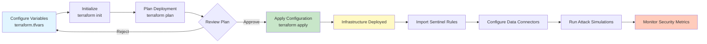

# Terraform Infrastructure as Code

This directory contains Terraform configuration files to deploy the Azure Honeynet infrastructure as code.

## Deployment Workflow



- [Terraform](https://www.terraform.io/downloads) >= 1.0
- [Azure CLI](https://docs.microsoft.com/cli/azure/install-azure-cli) installed and configured
- Azure subscription with appropriate permissions
- SSH key pair (for Linux VM access)

## Quick Start

### 1. Authenticate with Azure

```bash
az login
az account set --subscription "Your-Subscription-ID"
```

### 2. Configure Variables

```bash
# Copy the example variables file
cp terraform.tfvars.example terraform.tfvars

# Edit terraform.tfvars with your values
# IMPORTANT: Update passwords, SSH keys, and admin IP
```

### 3. Initialize Terraform

```bash
cd terraform
terraform init
```

### 4. Review the Plan

```bash
terraform plan
```

### 5. Deploy Infrastructure

```bash
terraform apply
```

Type `yes` when prompted to confirm the deployment.

## Deployment Modes

### Initial Deployment (Honeynet Mode)

Deploy with `hardened = false` in `terraform.tfvars` to create an intentionally exposed environment for capturing attack traffic.

```hcl
hardened = false
```

### Hardened Deployment

After collecting metrics, redeploy with `hardened = true` and your admin IP:

```hcl
hardened = true
admin_ip = "YOUR_PUBLIC_IP/32"  # e.g., "203.0.113.0/32"
```

Then run:
```bash
terraform apply
```

## Outputs

After deployment, Terraform will output:
- Public IP addresses of all VMs
- Log Analytics Workspace ID
- Key Vault and Storage Account names
- Network Security Group name

Access outputs with:
```bash
terraform output
```

## Importing Sentinel Analytics Rules

After infrastructure deployment, import the Sentinel analytics rules:

1. Navigate to Microsoft Sentinel in Azure Portal
2. Go to Analytics > Active rules
3. Import the rules from `../AzureHoneyNet/Sentinel-Analytics-Rules/Sentinel-Analytics-Rules(KQL Alert Queries).json`

Or use the Azure CLI:
```bash
# Example: Import a single rule (adjust as needed)
az sentinel analytics-rule create \
  --workspace-name <workspace-name> \
  --resource-group <resource-group> \
  --rule-id <rule-id> \
  --rule-file "../AzureHoneyNet/Sentinel-Analytics-Rules/Sentinel-Analytics-Rules(KQL Alert Queries).json"
```

## Cost Optimization

The default VM size is `Standard_B2s` (2 vCPUs, 4GB RAM) which is cost-effective for a honeynet lab.

**Estimated monthly cost (approximate):**
- 3x Standard_B2s VMs: ~$60-90/month
- Log Analytics (first 5GB free, then ~$2.30/GB): ~$10-30/month
- Storage Account: ~$1-5/month
- Key Vault: ~$0.03/month
- **Total: ~$70-125/month**

**To reduce costs:**
- Use `Standard_B1s` for smaller VMs (1 vCPU, 1GB RAM)
- Set shorter log retention periods
- Deploy only during testing periods
- Use Azure Dev/Test pricing if eligible

## Destroying Resources

To tear down all infrastructure:

```bash
terraform destroy
```

**Warning:** This will delete all resources and data. Make sure you've exported any important logs or data first.

## Backend Configuration (Optional)

For team collaboration, configure a remote backend:

1. Create a storage account and container for Terraform state
2. Update `backend "azurerm"` block in `main.tf`
3. Create `backend.tfvars`:

```hcl
resource_group_name  = "tfstate-rg"
storage_account_name = "tfstate<unique>"
container_name       = "tfstate"
key                  = "honeynet.terraform.tfstate"
```

Then initialize with:
```bash
terraform init -backend-config=backend.tfvars
```

## Troubleshooting

### Authentication Issues
```bash
az login --tenant <tenant-id>
az account list --output table
```

### Permission Errors
Ensure your Azure account has:
- Contributor or Owner role on the subscription
- Ability to create resource groups

### VM Deployment Failures
- Check quota limits in your subscription
- Verify VM size availability in your region
- Ensure sufficient subscription credits

## Security Notes

**Important Security Considerations:**

1. **Never commit `terraform.tfvars`** - It contains sensitive credentials
2. **Use Azure Key Vault** for production deployments to store secrets
3. **Rotate passwords** regularly
4. **Enable MFA** on your Azure account
5. **Review NSG rules** before deploying to production
6. **Use Private Endpoints** for production workloads

## Next Steps

After deployment:
1. Configure Microsoft Sentinel data connectors
2. Import Sentinel analytics rules
3. Configure log collection on VMs
4. Run attack simulation scripts
5. Monitor security metrics

See the main [README.md](../README.md) for more details.

